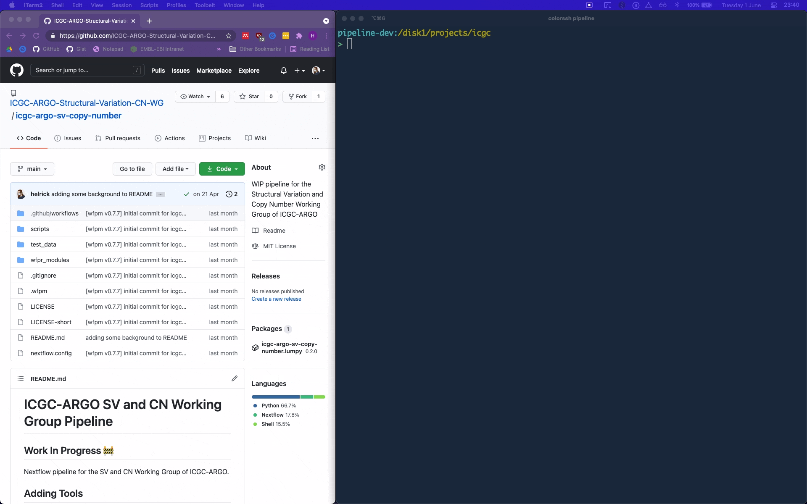
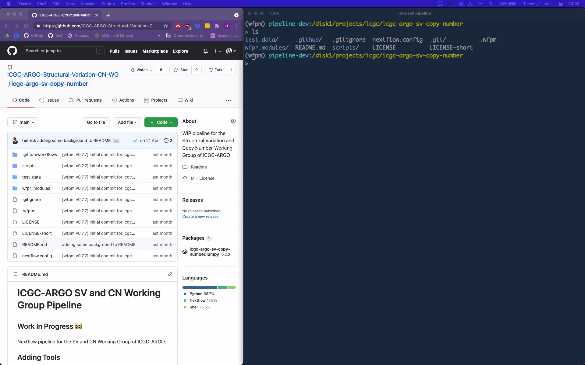
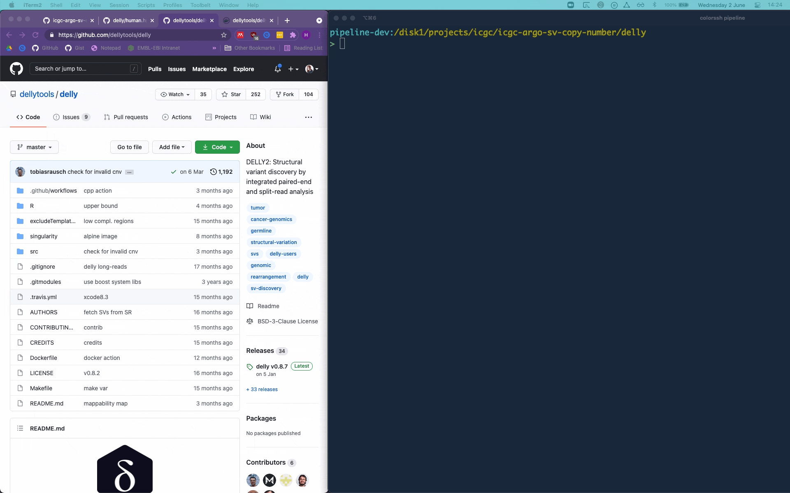

# ICGC-ARGO SV and CN Working Group Pipeline

## Work In Progress 🚧

Nextflow pipeline for the SV and CN Working Group of ICGC-ARGO.

## Adding Tools

### Requirements
* Docker
* wfpm and dependencies installed ([see instructions](https://wfpm.readthedocs.io/en/latest/README.html#installation))

### 1. Clone this Repository
```bash
git clone https://github.com/ICGC-ARGO-Structural-Variation-CN-WG/icgc-argo-sv-copy-number.git
```


### 2. Create a new tool with wfpm
```bash
wfpm new tool delly
```


Here I've kept most of the defaults. I'm using alpine-linux as a base image, but anything can be used, including an existing Docker image for the tool.

Now if you run `wfpm workon` you should see a message that you're working on your tool package. There should also be a new folder for your tool

### 3. Create Docker Image

This can be done several different ways, but in this example I'm adding the tool [Delly](https://github.com/dellytools/delly) with Docker

#### 3a) No Docker Image Available for Tool

If there's no Docker image available for your tool, you can use a "base image" of a Linux operating system and write the steps to install it. It will likely be an iterative process, similar to installing the tool on a brand new machine. You can test building until there are no missing dependencies.

Here is an example of a Dockerfile that installs Delly into an alpine-linux base image. I used alpine base image because it's a bit smaller than Ubuntu, but you can use any Linux distribution (or base image) that you prefer.

```Dockerfile
FROM alpine:latest

# filled by wfpm
LABEL org.opencontainers.image.source https://github.com/icgc-argo-structural-variation-cn-wg/icgc-argo-sv-copy-number

# add the dependencies 
# (apk is alpine's package manager, Ubuntu would be apt-get)
RUN apk update && \
    apk add --no-cache \
    bash util-linux coreutils \
    git curl \
    make cmake gcc g++ libstdc++ libgcc autoconf automake \
    zlib-dev curl-dev

# clone from the Delly repo & follow install instructions to make
RUN git clone --recursive https://github.com/dellytools/delly.git \
    && cd delly \
    && make all

# add the Delly tool to the image's path
ENV PATH="/delly/bin:${PATH}"

# default command executed
CMD ["/bin/sh"]
```

#### 3b) Docker Image _Is_ Available for Tool

In this example, Delly does have a [docker image available](https://hub.docker.com/r/dellytools/delly/tags?page=1&ordering=last_updated). If this is the case, you can use it as your "base" image and just add a label and default command like so:

```Dockerfile
FROM dellytools/delly:latest

LABEL org.opencontainers.image.source https://github.com/icgc-argo-structural-variation-cn-wg/icgc-argo-sv-copy-number

CMD ["/bin/sh"]
```

### 4. Test Building Image

In both cases you can test building the Dockerfile when inside your tool directory (in this case `/delly`) by running:
```bash
docker build .
```
It should report any dependencies issues or syntax errors. Here is an example of a successful build of the Dockerfile from 3b.
```bash
> docker build .
Sending build context to Docker daemon  18.94kB
Step 1/4 : FROM dellytools/delly:latest
 ---> 5e497753dc56
Step 2/4 : LABEL org.opencontainers.image.source https://github.com/icgc-argo-structural-variation-cn-wg/icgc-argo-sv-copy-number
 ---> Using cache
 ---> bf5d202c124c
Step 3/4 : ENTRYPOINT ["/usr/bin/env"]
 ---> Using cache
 ---> 1b9a69d0a9b7
Step 4/4 : CMD ["/bin/sh"]
 ---> Using cache
 ---> 4abfb61e7e50
Successfully built 4abfb61e7e50
```
The image ID will be printed on the last line, in this case `4abfb61e7e50`. You can then test "spinning up" a docker container using you image like so:
```bash
docker run --rm -it <image-id>
```

This is similar conceptually to creating a virtual machine from a base operating system. Since the final `CMD` line instructs the image to execute `/bin/sh`, that's what will be executed when you build the container from the image.

From within the container you can run your tool command, in this case `delly` and ensure that the program is installed correctly.

The `--rm` flag means that you don't want to keep the container around after you exit it. To exit the container you can simply run `exit`.



### 5. Use the tool in Nextflow

The `main.nf` file within your tool directory should now be able to use your tool. You can edit it to change the parameters:
```groovy
params.exclude_file = ""
params.reference_fasta = ""
params.tumour_bam = ""
params.normal_bam = ""
params.output_pattern = "*.bcf"  // output file name pattern
```
and script code:
```groovy
  input:  // input, make update as needed
     path exclude_file
     path reference_fasta
     path tumour_bam
     path normal_bam

   output:  // output, make update as needed
     path "output_dir/${params.output_pattern}", emit: output_file

   script:
     // add and initialize variables here as needed
     """
     mkdir -p output_dir

     delly call -x ${exclude_file} -o output_dir/output.bcf -g ${reference_fasta} ${tumour_bam} ${normal_bam}
     """
```

You can test running by generating a `parameters.json` file or passing your input parameters on the command line (you will likely get an error, continue reading):
```bash
nextflow -C nextflow.config run main.nf -params-file example-params.json
```
Where the `example-params.json` contains:
```bash
{
    "exclude_file": "<local/path/to/file>",
    "reference_fasta": "<local/path/to/file>",
    "tumour_bam": "<local/path/to/file>",
    "normal_bam": "<local/path/to/file>",
    "publish_dir": "outdir",
    "cpus": 1,
    "mem": 4
}
```

When running your module for the first time, nextflow will complain that the image `ghcr.io/icgc-argo-structural-variation-cn-wg/wfpm-demo.<tool>:<version>` is not found. This is because you have not yet pushed and merged your code (see below) and the docker image is not yet available at `ghcr.io`. A neat workaround is to build a local docker image with the exact name that nextflow is looking for (defined in your `main.nf`, and stated in the error message). Go to your tool directory and run:
```bash
# adjust the name according to your tool and version!
docker build . -t ghcr.io/icgc-argo-structural-variation-cn-wg/wfpm-demo.delly:0.1.0
```

Now you will be able to run your tool using the `nextflow run` command above.

### 6. Push Branch

Once the tool is working and installed, you can push your tool branch via:

First push your branch via:
```
git push -u origin <tool-name>@<version-number>
```

GitHub will attempt to run tests when you push your branch, and they will almost certainly fail since they haven't been written yet. This is ok though because the branch is still a WIP.

### 7. Write Tests

Within the `tests/` directory, you can edit the `checker.nf` and `test-job-<N>.json` files to create a minimal test of the tool. You can create as many tests as you want, by creating incremental `test-job-<N>.json` files.

To test locally you can run `wfpm test` (you have to have the corresponding local image as described at the end of section **5** if you still have not pushed your code).

### 8. Publish tool

Once you're satisfied with your tests and they pass successfully, you can open a pull request (PR) with your branch. Keep the default title, but enter `[release]` as the PR body.

After merging, your tool should be able to be used in the SV and Copy Number pipeline! 🎉

 
